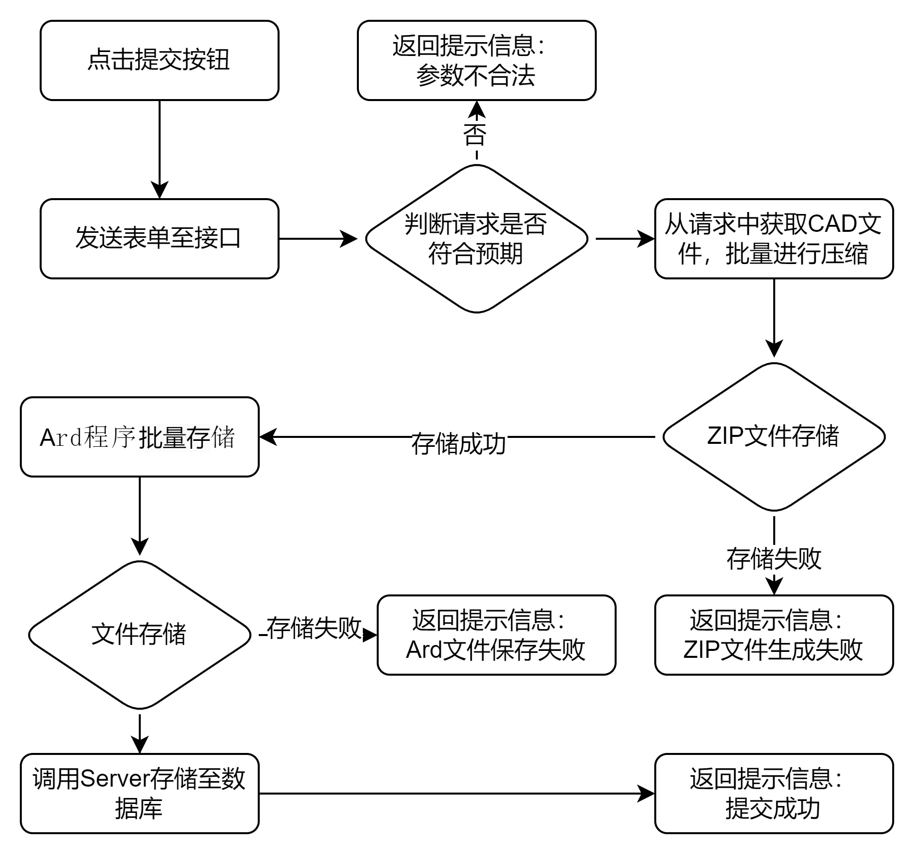

# CNC-Ard上传下载 开发文档

## 1. 概述

### 1.1 项目简介

- #### 项目背景与目标

  解决木工CNC-Ard程序上传下载，构建起工程师与操作员之间的桥梁。
- #### 专业术语解释

  <u>MVC</u>：一种软件设计模式，用于将应用程序的逻辑分为三个核心组件，目的是实现代码的模块化、可维护性和可扩展性。<br>
  <u>Spring Boot</u>： 基于 Spring 框架的快速开发工具，旨在简化 Spring 应用的初始搭建和开发过程。<br>
  <u>Spring</u>：轻量级、开源的 Java 开发框架，核心目标是简化企业级应用开发，通过控制反转(IoC)和面向切面编程(AOP)
  实现组件松耦合。<br>
  <u>MyBatis</u>：一款持久层框架，用于简化 Java 应用程序与关系型数据库的交互。<br>
  <u>Bootstrap</u>：前端框架，基于 HTML、CSS 和 JavaScript，用于快速开发响应式、移动优先的网页。<br>
  <u>jQuery</u>：轻量级的 JavaScript 库，简化 DOM 操作、事件处理、AJAX 请求等。<br>

### 1.2 功能概述

- ##### 核心功能清单
  |**功能列表**|**详情说明**|
  |:--|--|
  |文件上传|CNC多文件上传；Ard单文件逐个上传|
  |文件下载||
  |上传/下载历史记录|记录上传、下载的时间及人员|
  |自动版本名生成|依据升版和修订的区别，动态构建版本号|
  |文件挂起|记录挂起原因，同时不允许文件被下载并在企业微信提醒工程师|
  |数据看板|概览总体数据|
- ##### 系统架构图

  
- ##### 技术栈说明

  后端选用`Java1.8`作为主要开发语言，`Spring boot2.7.X`作为核心容器，配合`MyBatis`实现持久层解决方案。基于Spring
  Security实现多层安全防护。集成`Dynamic-Datasource 3.5.x`实现异构数据源统一管理。

  前端使用`bootstrap4`框架构建响应式页面布局，`jquery3.7.1`作为与后端交互的主要媒介，构建`SPA`前端路由通过动态替换内容实现无刷新页面切换。

  使用`DataGear`制作数据看板，直观显示系统的整体概况。

## 2. 环境要求

### 2.1 硬件需求

- ##### 最低配置

  2核4GB+50GB SSD，适用于轻量运行或开发测试
- ##### 推荐配置

  4核8GB+100GB SSD及独立数据库，稳健支持生产环境及中等并发。

### 2.2 软件依赖

- ##### 操作系统版本

  <u>开发环境</u>：Windows 10<br>

  <u>正式环境</u>：Windows Server 2016 Standard
- ##### 运行时环境

  JDK: Java SE 8（需安装 JDK 1.8+）
- ##### springBoot配置文件
  ```properties
  spring.application.name=demo
  # SQL Server
  spring.datasource.dynamic.primary=master
  spring.datasource.dynamic.datasource.master.url=jdbc:sqlserver://10.10.10.104:1433;databaseName=sql_server01;encrypt=true;trustServerCertificate=true;characterEncoding=UTF-8;sendStringParametersAsUnicode=true
  spring.datasource.dynamic.datasource.master.username=user01
  spring.datasource.dynamic.datasource.master.password=*******
  spring.datasource.dynamic.datasource.master.driver-class-name=com.microsoft.sqlserver.jdbc.SQLServerDriver
  # oracle
  spring.datasource.dynamic.datasource.crew1.url=jdbc:oracle:thin:@//10.10.10.101:1521/topprd
  spring.datasource.dynamic.datasource.crew1.username=mesuser
  spring.datasource.dynamic.datasource.crew1.password=*******
  spring.datasource.dynamic.datasource.crew1.driver-class-name=oracle.jdbc.OracleDriver
  spring.datasource.dynamic.datasource.crew2.url=jdbc:sqlserver://10.10.10.15:1433;databaseName=ecology;encrypt=false
  spring.datasource.dynamic.datasource.crew2.username=mesuser
  spring.datasource.dynamic.datasource.crew2.password=*******
  spring.datasource.dynamic.datasource.crew2.driver-class-name=com.microsoft.sqlserver.jdbc.SQLServerDriver
  #aMADA
  file.upload.dir=./resources/file
  file.temp.dir=./resources/temp
  file.backup.dir=./resources/backup
  spring.servlet.multipart.max-file-size=10GB
  spring.servlet.multipart.max-request-size=20GB
  spring.jackson.date-format=yyyy-MM-dd'T'HH:mm:ss.SSS'Z'
  spring.jackson.time-zone=GMT+8
  # application.properties
  server.servlet.encoding.charset=UTF-8
  server.servlet.encoding.enabled=true
  server.servlet.encoding.force=true
  spring.jpa.open-in-view=false
  logging.level.root=INFO
  ```
- ##### 第三方库清单
  ```xml
    <!--后端相关依赖-->
    <!-- Spring Boot Starter DataSource -->
          <dependency>
              <groupId>org.springframework.boot</groupId>
              <artifactId>spring-boot-starter-jdbc</artifactId>
          </dependency>
          <!-- SQL Server JDBC Driver -->
          <dependency>
              <groupId>com.microsoft.sqlserver</groupId>
              <artifactId>mssql-jdbc</artifactId>
              <version>10.2.3.jre8</version>
          </dependency>
          <!-- MyBatis Spring Boot Starter -->
          <dependency>
              <groupId>org.mybatis.spring.boot</groupId>
              <artifactId>mybatis-spring-boot-starter</artifactId>
              <version>${mybatis-starter.version}</version>
          </dependency>
          <dependency>
              <groupId>org.springframework.boot</groupId>
              <artifactId>spring-boot-starter-web</artifactId>
          </dependency>
          <dependency>
              <groupId>org.projectlombok</groupId>
              <artifactId>lombok</artifactId>
              <version>${lombok.version}</version>
              <scope>provided</scope>
          </dependency>
          <dependency>
              <groupId>org.springframework.boot</groupId>
              <artifactId>spring-boot-starter-test</artifactId>
              <scope>test</scope>
          </dependency>
          <dependency>
              <groupId>org.springframework.boot</groupId>
              <artifactId>spring-boot-starter-security</artifactId>
          </dependency>
          <dependency>
              <groupId>org.springframework.boot</groupId>
              <artifactId>spring-boot-starter-data-jpa</artifactId>
          </dependency>
          <dependency>
              <groupId>com.oracle.database.jdbc</groupId>
              <artifactId>ojdbc8</artifactId>
              <version>${ojdbc.version}</version>
          </dependency>
  
          <dependency>
              <groupId>com.baomidou</groupId>
              <artifactId>dynamic-datasource-spring-boot-starter</artifactId>
              <version>3.5.2</version>
          </dependency>
  
          <dependency>
              <groupId>com.example</groupId>
              <artifactId>RSA</artifactId>
              <version>0.0.1</version>
          </dependency>
  
          <dependency>
              <groupId>org.apache.httpcomponents</groupId>
              <artifactId>httpclient</artifactId>
              <version>4.5.14</version>
          </dependency>
  
          <dependency>
              <groupId>com.fasterxml.jackson.core</groupId>
              <artifactId>jackson-databind</artifactId>
              <version>2.12.7.1</version>
          </dependency>
      </dependencies>
  ```
  ```html
       <!--前端相关依赖-->
       <link rel="stylesheet" href="../bootstrap/css/bootstrap.min.css">
       <script src="../js/jquery-3.7.1.min.js"></script>
       <script src="../bootstrap/js/bootstrap.min.js"></script>
  ```

### 2.3 数据库

- #### [建库脚本](resources/script.sql)
- #### E-R图

  

## 3. 使用说明

### 3.1 快速入门

- #### [培训文档](resources/px.pptx)

### 3.2 功能详解

- ##### 文件上传流程图

  

## 4. API 文档

- #### [接口文档](https://apifox.com/apidoc/shared-356ddd96-0ec2-4ce3-badb-642210aee4b1)

## 5. 开发指南

### 5.1 项目目录说明

```tree
com.example.demo  
├── config              // Spring配置类（如安全配置、MVC配置）  
├── controller          // 控制器层（处理HTTP请求）  
│   ├── FileCollect     // 文件相关接口（如上传/下载）  
│   ├── FindCollect     // 文件查询接口  
│   └── UserController  // 用户管理接口 
│   └── ... 
├── dto                 // 数据传输对象（DTO）  
│   └── CncFileDownloadDto  // CNC文件下载的DTO  
├── mode                // 数据库实体类  
│   ├── Category        // 分类实体  
│   ├── CncDetail       // CNC加工详情实体  
│   └── ...             // 其他实体类（如UserEntity）  
├── repository          // 数据访问层（MyBatis Mapper接口）  
│   ├── CategoryMapper          // 分类表操作  
│   ├── CncDetailMapper         // CNC详情表操作  
│   └── ...  
├── service             // 业务逻辑层  
│   ├── CategoryService         // 分类业务逻辑  
│   ├── CncDetailService        // CNC详情业务逻辑  
│   └── ...  
├── utils               // 工具类   
│   └── FileUtils // 文件操作工具类  
│   └── OATokenUtils    // OA接口Token获取工具
│   └── ...  
└── DemoApplication     // Spring Boot启动类  
```

### 5.2 设计模式应用

- <u>MVC设计模式</u>：Controller(如 UserController)处理请求，Service(如 UserService)实现业务逻辑，Model(如 UserEntity)封装数据。
- <u>依赖注入</u>：Spring 框架自动注入 @Service 和 @Repository 的 Bean(如 UserService 依赖 UserMapper)。
- <u>DTO模式</u>：使用 CncFileDownloadDto 隔离实体类与接口数据，避免直接暴露数据库结构。
- <u>DAO模式</u>：Mapper 接口(如 CncDetailMapper)抽象数据库操作，解耦业务与持久化逻辑。

## 6.项目部署

### 6.1 正式运行地址

- #### ~~[木工CNC]()~~

### 6.2 体验账号：

| 账户  | 密码     | 说明             |
|-----|--------|----------------|
| 001 | 123456 | 具有工艺工程师权限的体验账户 |
| 002 | 123456 | 具有操作员权限的体验账户   |

#### 部分运行图


### 6.3 部署详情说明

- 端口`8080`为java后端程序占用端口。
- 端口`8000`为前端页面占用端口。
- 端口`50401`为数据看板占用端口。
- 使用Nginx对请求进行控制，相关配置文件
  ```apache_conf
  
  #user  nobody;
  worker_processes 1;
  
  #error_log  logs/error.log;
  #error_log  logs/error.log  notice;
  #error_log  logs/error.log  info;
  
  #pid        logs/nginx.pid;
  events {
      worker_connections 1024;
  }
  
  
  http {
      include mime.types;
      default_type application/octet-stream;
  
      log_format main '$remote_addr - $remote_user [$time_local] "$request" '
      '$status $body_bytes_sent "$http_referer" '
      '"$http_user_agent" "$http_x_forwarded_for"';
  
      access_log logs/access.log main;
  
      sendfile on;
      #tcp_nopush     on;
  
      #keepalive_timeout  0;
      keepalive_timeout 65;
  
      #gzip  on;
  
      server {
          listen 8000;
          server_name tonwel.cnc.com;
  
          # 设置根目录和默认索引
          root html/view;
          index login.html;
  
          # 自定义404页面
          error_page 500 404 /pages/404.html;
  
          # 确保404.html能被正确找到（防止循环重定向）
          location = /pages/404.html {
              internal;
          }
  
          location / {
              try_files $uri $uri/ $uri/login.html =404;
          }
      }
  
      # 维护时使用
      # server {
      #     listen 8000;
      #     server_name localhost;
  
      #     # 所有请求重定向到维护页面
      #     location / {
      #         return 503;
      #     }
      #     # 自定义维护页面
      #     error_page 503 /maintenance.html;
      #     location = /maintenance.html {
      #         root html/view/pages;
      #         internal;
      #     }
      # }
      # server {
      #     listen       8111;
      #     server_name  localhost;
      #     location / {
      #         root    html/view;
      #         index   login.html;
      #     }
      # }
  }
  
  ```
